# REAP Scorecard: user guide

This guide is for consultants and company users. It covers signing in, adding a
company, working out a full B-BBEE scorecard, working out a procurement score
on its own, and printing reports. The pictures come from the final test run on
staging, using fictional data.

## The two things you can work out

| | Full B-BBEE scorecard | Procurement only |
|---|---|---|
| What it gives you | The company's B-BBEE level (1 to 8, or Non-compliant) from all seven elements | How much the company buys from B-BBEE suppliers, out of 29 points |
| What you need | The REAP scorecard workbook (Excel) | The total spend and the list of suppliers |
| How they fit | Procurement is one of the seven elements. You attach a procurement scorecard to it | Use it on its own, or attach it to a full scorecard later |

Both start from **Start new** at the top of the menu.

## 1. Sign in

- **Sign in** with your e-mail and password.
- **Create account** if you are new. You get an e-mail. Click its link and you
  are signed in.
- **Forgot password?** sends a link to your e-mail. It lets you choose a new
  password; the old one stops working.

## 2. Home

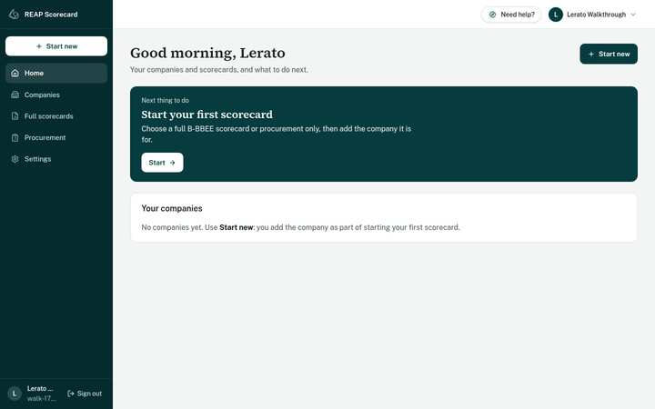

Home always shows **the next thing to do** in the dark box. Below it are your
companies and your most recent work. Once you have work, each scorecard shows
its status, for example "Final level" or "Needs calculating", with a link
straight to it.

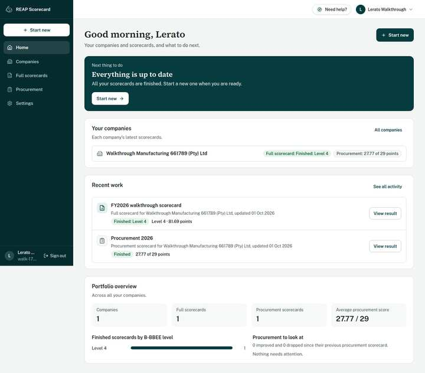

The menu has the same places on every page: **Home**, **Companies**, **Full
scorecards**, **Procurement** and **Settings**. On a phone, tap **Menu** at
the top.

## 3. Start something new

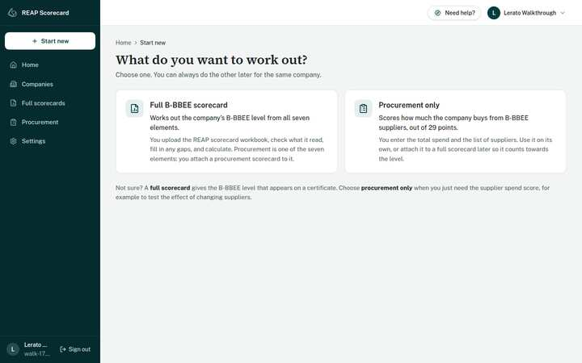

Choose **Full B-BBEE scorecard** or **Procurement only**. Then choose the
company, or **Add a company**. A company only needs a name. When you save it,
you carry straight on.

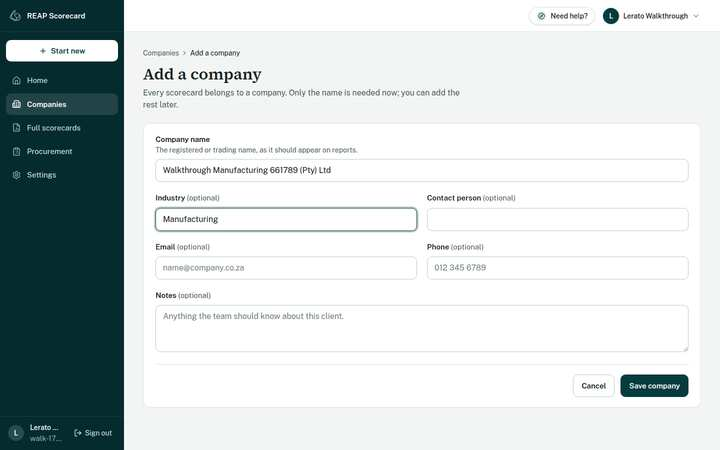

## 4. Full B-BBEE scorecard

The steps bar at the top always shows where you are:
**Start → Upload workbook → Check imported data → Complete the elements → See result**.

### Upload the workbook

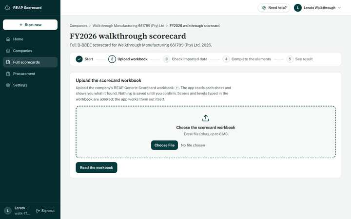

Choose the REAP scorecard workbook (.xlsx) and click **Read the workbook**.
Nothing is saved yet. If the file is not an Excel workbook, the app says so
in plain words and nothing changes:

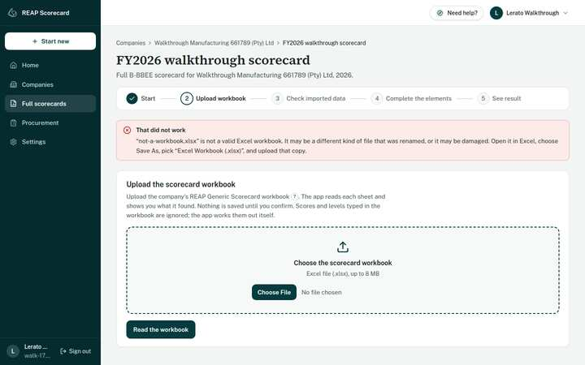

### Check what it read

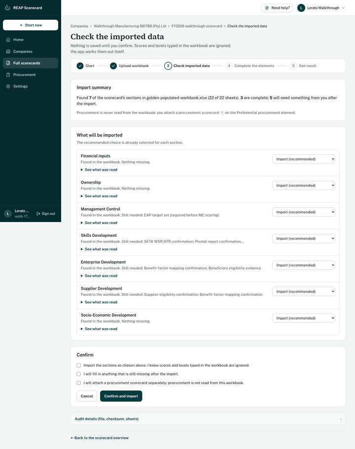

There is one row per section of the workbook, with what was found and anything
missing. Tick the boxes to say you have checked it, and click **Confirm and
import**. Scores and levels typed into the workbook are ignored. The app works
them out itself.

### Complete the elements

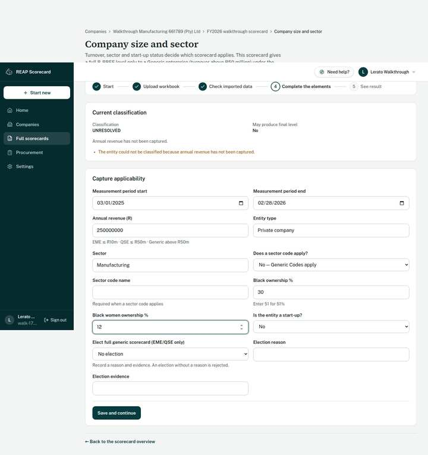

Start with **Company size and sector**. Turnover decides which scorecard
applies:

- an EME (up to R10m) or a QSE (up to R50m) uses a smaller scorecard;
- above R50m, the full Generic scorecard applies.

Then open each element. Every element page starts with its points and what is
still needed. The inputs are below.

- **Skills development.** Confirm the four gates: the SETA-approved
  WSP/ATR, the PIVOTAL report, the priority skills programme, and the trainee
  register. Until you confirm them, skills spending cannot score.

  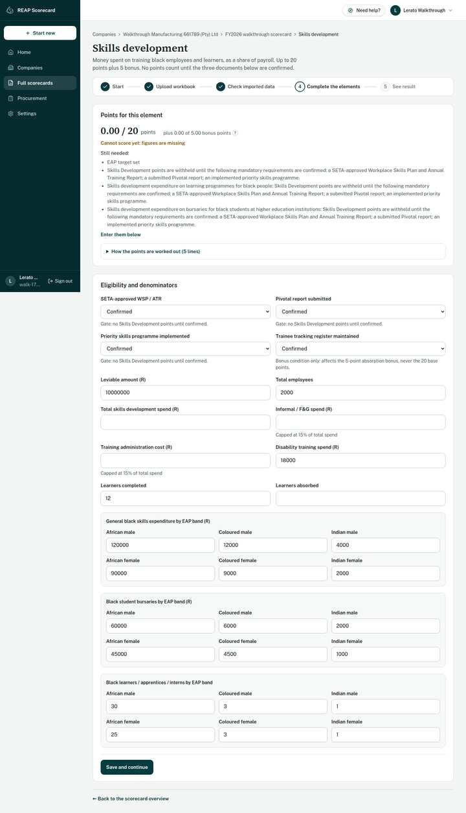

- **Enterprise development, supplier development and socio-economic
  development.** Each imported contribution needs its evidence confirmed.
  Enter the invoice or proof-of-payment reference and tick the box. Nothing
  counts until a person has checked the evidence.

  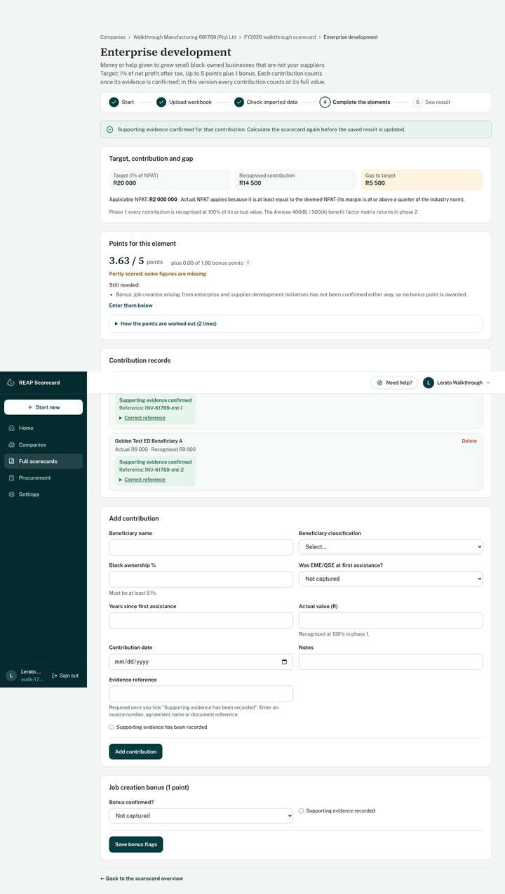

- **Management control and skills.** These are measured against the
  workforce (EAP) targets for the year. You attach them on the Calculate step
  with one click; REAP staff keep the targets up to date.

- **Procurement.** Attach a procurement scorecard for the same company, or
  click **Create a procurement scorecard**. You come straight back here
  afterwards, ready to attach it.

  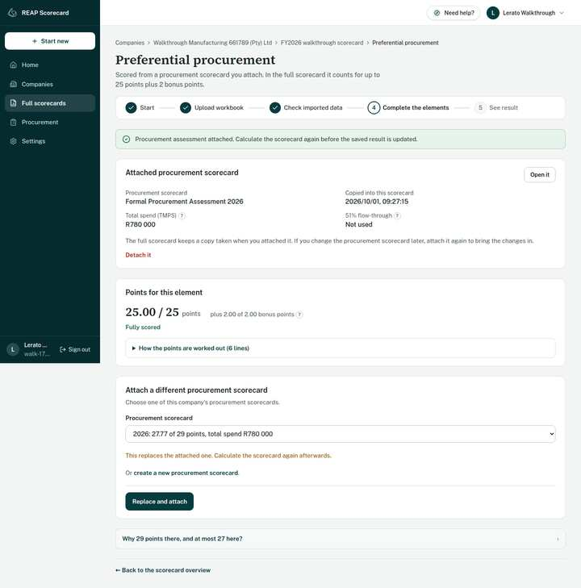

  **Why 29 points there and at most 27 here?** On its own, a procurement
  scorecard scores five categories (27 points) plus 2 bonus points, out of 29.
  In the full scorecard, the five categories count for at most 25 points. The
  2 bonus points count separately, so they never fill the 25. That makes 27
  at most. The 40% sub-minimum is measured on the 25.

### Calculate and see the result

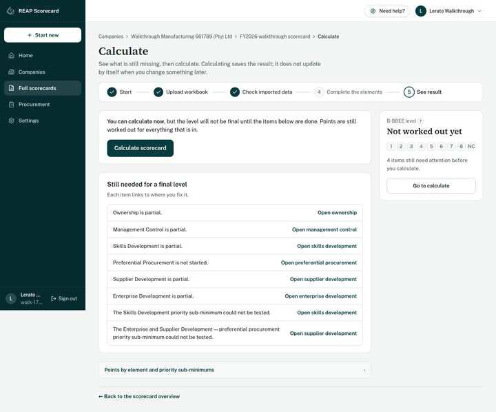

**Calculate** lists everything still missing for a final level; each item links
to where you fix it. One click on **Calculate scorecard** gives the result:

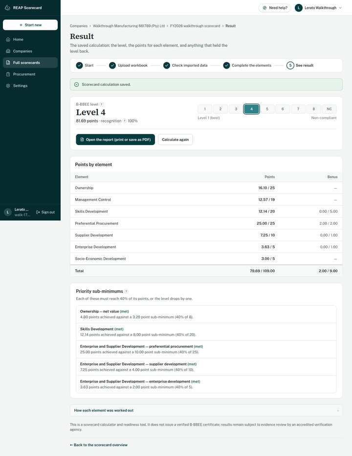

The result shows the level, the points by element, and the priority
sub-minimums. Missing a sub-minimum drops the level by one. If you change
anything afterwards, the result says **Changed since this was calculated**
until you calculate again.

### Report

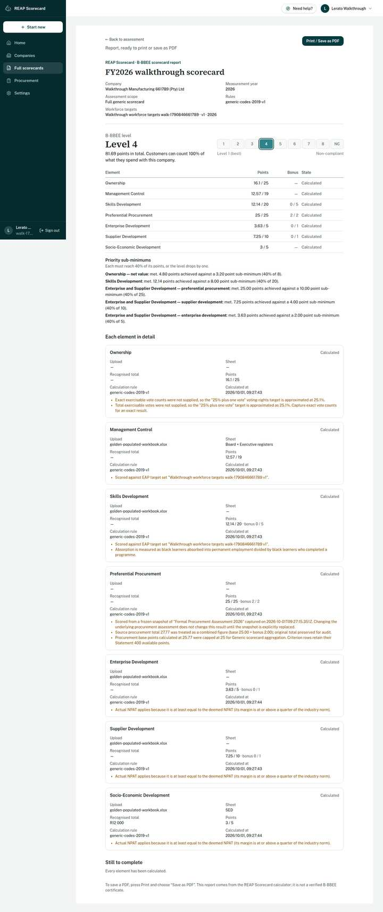

**Open the report** gives a printable summary. Use your browser's
**Print → Save as PDF** to keep or send it.

## 5. Procurement only

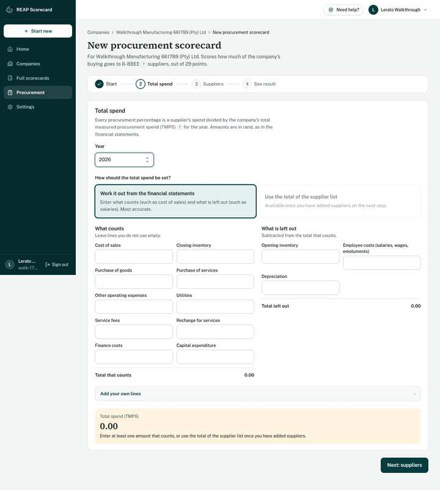

**Step 1, Total spend.** Choose how the total is found:

- work it out from the financial statement (cost of sales, operating
  expenses and so on, minus the excluded items); or
- use the total of the supplier list.

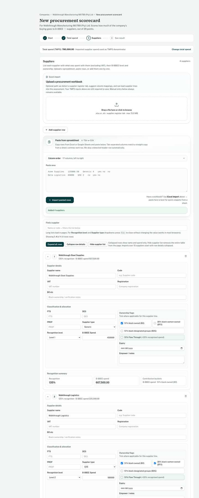

**Step 2, Suppliers.** Add suppliers in one of three ways:

- import a spreadsheet;
- paste rows copied from Excel;
- add them one by one.

For each supplier, give the spend, the B-BBEE level, the type (EME, QSE or
Generic) and the ownership ticks. The score updates as you go. Click **Save
and see result**.

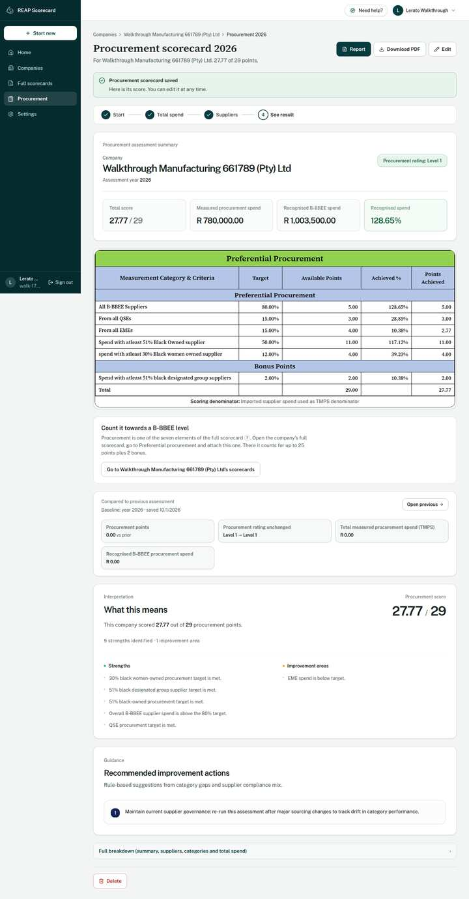

The result shows the points out of 29 and each category. **Edit** changes it.
**Report** opens a printable page with **Download PDF**. **Delete** asks you to
confirm, and removes the scorecard for good.

## 6. Words used in the app

A word with a small **?** after it is explained when you tap the **?**. The
main ones are:

- **B-BBEE level**: 1 (best) to 8, or Non-compliant, from the total points.
- **Recognition**: how much of a supplier's spend counts for its customers,
  from 135% at Level 1 down to 0% for Non-compliant.
- **EME / QSE / Generic**: company size by turnover (up to R10m / up to R50m /
  above).
- **TMPS**: total measured procurement spend, the total that procurement
  percentages are measured against.
- **EAP**: economically active population, the workforce shares that
  management and skills targets are split by.
- **Priority sub-minimum**: five parts must each reach 40% of their points,
  or the level drops by one. They are ownership net value, skills
  development, procurement, supplier development and enterprise development.

**Settings → Help** has the full list and a short guided tour.

## 7. For REAP staff

Staff accounts also see **Admin console** and **Workforce targets** in the menu.

- **Workforce targets.** Create a set for the year:
  1. Enter the six population shares as percentages.
  2. Click **Save shares**.
  3. Click **Put this set in use**.

  Scorecards attach the set in use.
- **Admin console.** Read-only views of every company, procurement scorecard
  and full scorecard, for support.

  

Other users cannot open either page.
