# REAP Scorecard: user guide

This guide is for consultants and company users. It covers signing in, adding a
company, working out a full B-BBEE scorecard, working out a procurement score
on its own, and downloading reports. The pictures come from staging, using
fictional data.

## The two things you can work out

| | Full B-BBEE scorecard | Procurement only |
|---|---|---|
| What it gives you | The company's B-BBEE level (1 to 8, or Non-compliant) from all seven areas | How the company's spending with suppliers scores: up to 25 points, plus 2 bonus points |
| What you need | The REAP scorecard workbook (Excel), or the figures to type in | The supplier list (Excel or CSV) with each supplier's spend and B-BBEE level |
| How they fit | Procurement is one of the seven areas. A procurement scorecard is attached to it | Use it on its own, or turn it into a full scorecard later and keep everything |

Not sure? Start with procurement. You can turn it into a full scorecard later.

## 1. Sign in

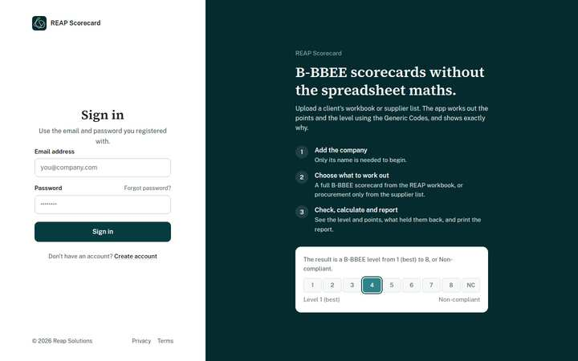

- **Sign in** with your e-mail and password.
- **Create account** if you are new. You get an e-mail. Open its link (on
  your phone or computer) and you are signed in.
- **Forgot password?** sends a link to your e-mail. It lets you choose a new
  password; the old one stops working.

## 2. Home

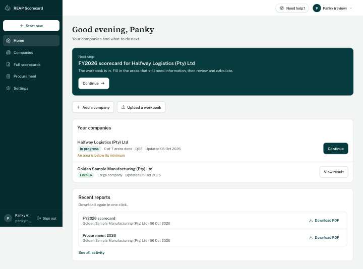

Home always shows **the next step** in the dark box, with one button. A new
account sees **Add your first company**. Below it:

- **Add a company** and **Upload a workbook**;
- **Your companies**: each with its size, where it stands ("Level 4", or "In
  progress, 5 of 7 areas done"), when it last changed, and one button;
- **Recent reports**, to download again in one click.

The menu has the same places on every page: **Home**, **Companies**, **Full
scorecards**, **Procurement** and **Settings**. On a phone, tap **Menu** at
the top.

## 3. Add a company

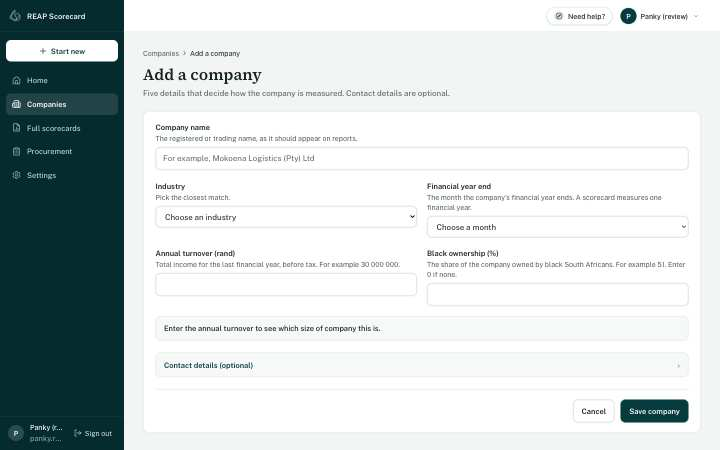

Five details: the name, the industry (pick the closest), the month the
financial year ends, the annual turnover and the black ownership. Contact
details are optional.

As you type the turnover, the app says what size of company it is, for
example "You're a QSE: R10 million to R50 million turnover". When the codes
give a company an automatic level (an EME, or a black-owned QSE), it says
**You may not need a full scorecard**, with the reason. Confirm that with
your verification agency.

When you save, you go straight to **What do you need?**

## 4. What do you need?

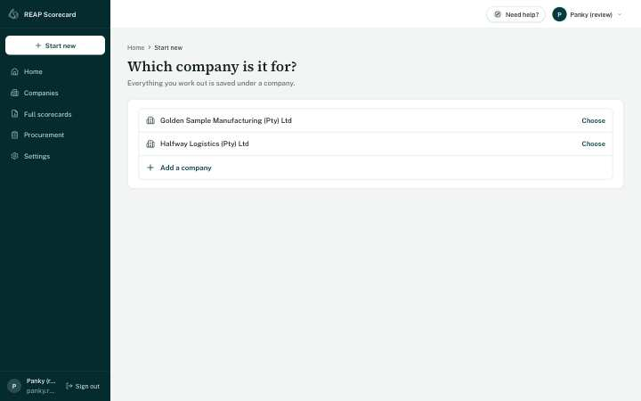

Choose the company (if you came from Start new), then one of two cards:
**Full B-BBEE scorecard** or **Procurement only**. Each says what it covers,
what it is used for and what you need.

## 5. Full B-BBEE scorecard

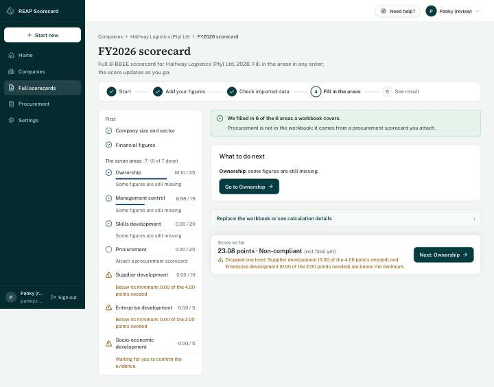

A new scorecard starts with the company's size and ownership filled in (from
last year's scorecard, or from the company's details). Then either:

- **Upload your workbook** (quick): the app reads it, shows what it found,
  and saves nothing until you click **Confirm and import**. Scores and levels
  typed into the workbook are ignored; the app works them out itself. It
  then says what it filled in, for example "We filled in 6 of the 6 areas a
  workbook covers". Procurement never comes from the workbook.
- **Or fill it in by hand**, area by area.

The checklist (on the left, or at the top on a phone) shows each area with a
tick, its points and a thin bar. Green is done, blue in progress, grey not
started, amber a problem. Work in any order.

The **score so far** stays in view (at the bottom on a phone). It updates as
you type and says plainly if a priority area below its minimum has dropped
the level by one. Its button takes you to the next unfinished area.

### An area

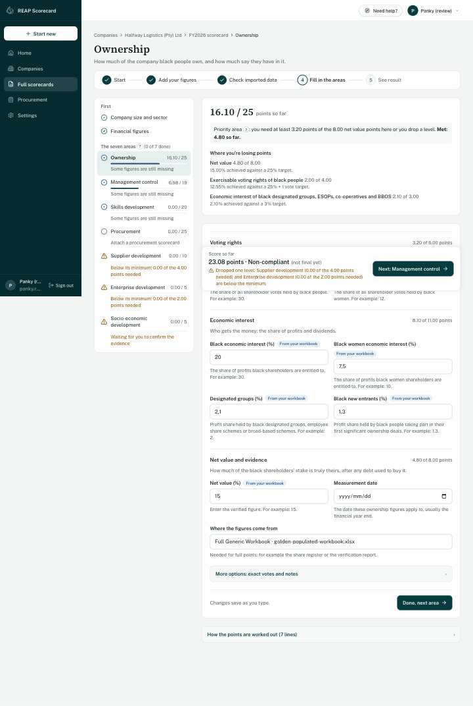

Each area starts with what it measures, its points so far, and, for a
priority area, the minimum: "You need at least 3.20 points here or you drop
a level". **Where you're losing points** names the lines with the most to
gain.

The figures are in short sections, each showing what it is worth. Every field
says what it is and gives an example. Figures from the workbook are tagged
**From your workbook**. If a figure looks wrong (more black women board
members than board members, say), a short "Is that right?" note appears next
to it; it is saved anyway. Rarely used fields are under **More options**.

Everything **saves as you type**. **Done, next area** takes you on.

A few areas need something before they can score:

- **Company size and sector.** The measurement period, the type of entity and
  whether a sector code applies.
- **Skills development.** The three gates (the SETA-approved WSP/ATR, the
  PIVOTAL report, the priority skills programme) and the training register.
- **Enterprise, supplier and socio-economic development.** Each
  contribution needs its evidence confirmed: type the invoice or
  proof-of-payment reference and tick the box. Nothing counts until a person
  has checked the evidence.
- **Management control and skills.** These are measured against the year's
  workforce (EAP) targets. Attach them on the review page with one click;
  REAP staff keep them up to date.
- **Procurement.** Attach a procurement scorecard for the same company, or
  click **Create a procurement scorecard**. You come straight back here to
  attach it. It counts up to 25 points, plus 2 bonus points kept apart.

### Review and result

**Review my scorecard** lists anything still missing for a final level, each
with a link to fix it. **Calculate scorecard** works out the result.

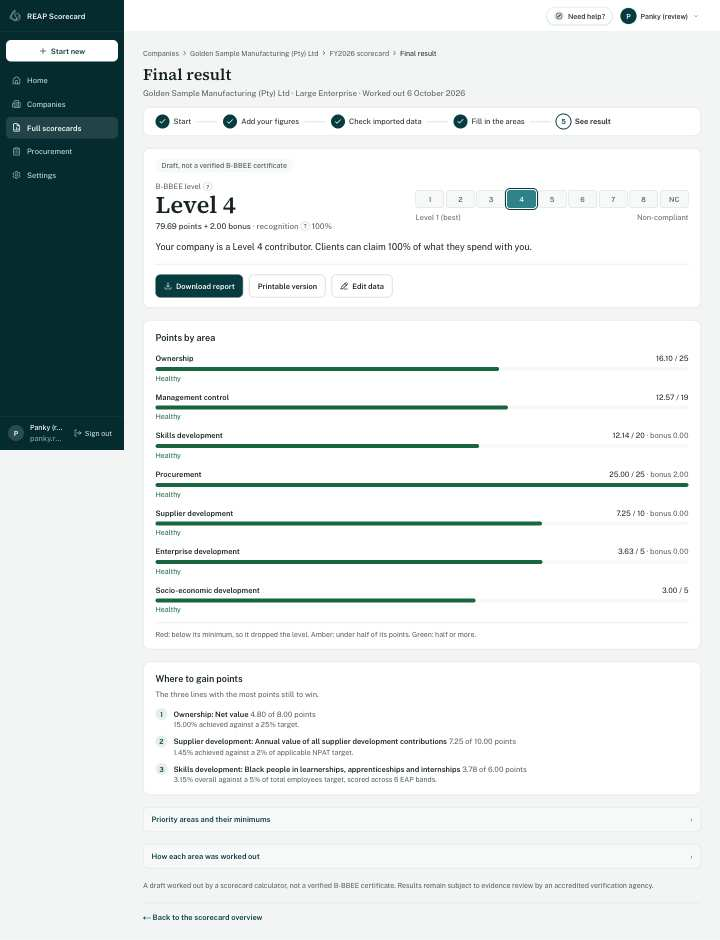

The result shows the level in large type, the points and bonus, the
recognition percentage, and one sentence on what it means for the company's
clients. A warning sits directly underneath if a priority area dropped the
level. Each area has a bar: red if it dropped the level, amber if it has less
than half its points, green otherwise. **Where to gain points** lists the top
three. It is always marked **Draft, not a verified B-BBEE certificate**.

If you change anything afterwards, the result says **Changed since this was
worked out** until you calculate again.

**Download report** gives a PDF; **Printable version** opens a page to print;
**Edit data** goes back to the areas; **Compare with** appears when there is
an earlier year.

## 6. Procurement only

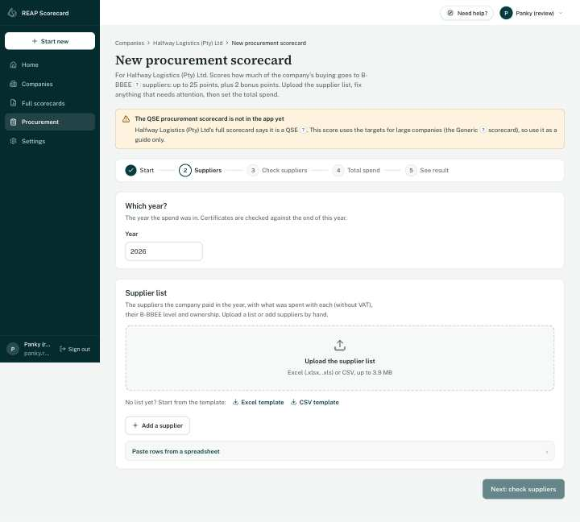

**Suppliers.** Upload the supplier list (Excel or CSV, up to 3.9 MB), or add
suppliers by hand. No list yet? Download the **Excel template** or **CSV
template**. The app matches the columns itself and says "We found 312
suppliers"; click **Use these suppliers**.

**Check suppliers.** **Needs attention** lists what would make the score
wrong, each with a one-click fix: expired certificates first (they score
nothing), missing levels, suppliers listed twice, and odd amounts. You can
save before fixing everything, but the score is marked **Incomplete** until
you do. Zero or negative amounts must be fixed first.

**Total spend.** The total measured procurement spend: what the company spent
on goods and services in the year without VAT, leaving out salaries,
depreciation and opening stock. It starts as the total of the supplier list;
**More options** works it out from the financial statements instead.

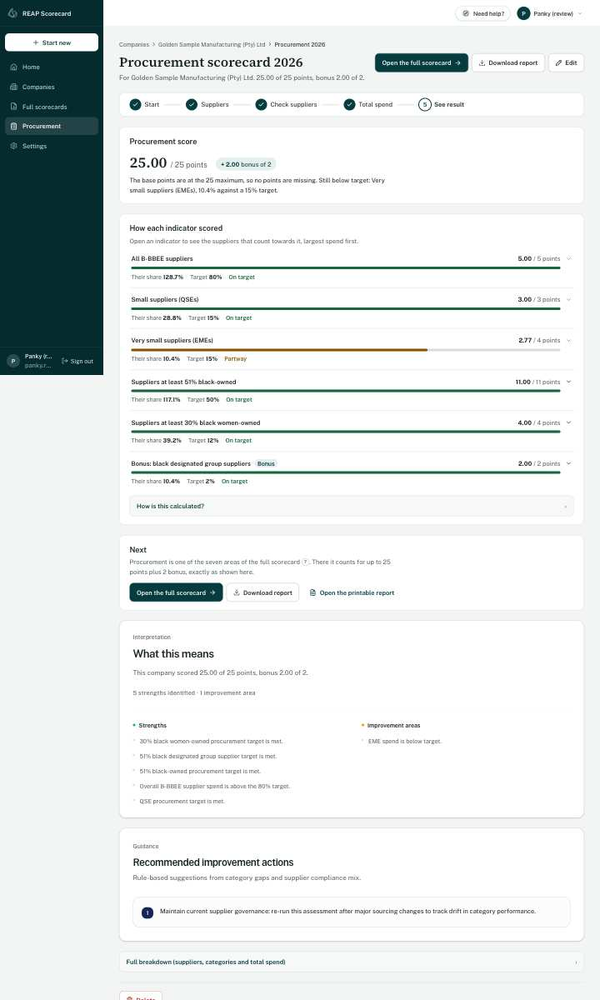

**The score** shows points out of 25, with the bonus apart, and one sentence
on the biggest gap. If something reduces the score it says so ("1 supplier
isn't counting because its certificate expired"). Each line shows the
company's share, the target, the points and a bar (green at target, amber
part of the way, red far off); open a line to see its suppliers by spend.
**How is this calculated?** shows the working.

**Download report** gives a PDF. **Continue to full scorecard** makes a full
scorecard for the same company with this procurement scorecard already in
it. **Edit** changes it; **Delete** asks first and removes it for good.

## 7. Words used in the app

A word with a small **?** after it is explained when you tap the **?**. The
main ones are:

- **B-BBEE level**: 1 (best) to 8, or Non-compliant, from the total points.
- **Recognition**: how much of a supplier's spend counts for its customers,
  from 135% at Level 1 down to 0% for Non-compliant.
- **EME / QSE / Generic**: company size by turnover (up to R10m / up to R50m /
  above).
- **TMPS**: total measured procurement spend, the total that procurement
  percentages are measured against.
- **EAP**: economically active population, the workforce shares that
  management and skills targets are split by.
- **Priority area minimum**: five priority areas must each reach 40% of their
  points, or the level drops by one. They are ownership net value, skills
  development, procurement, supplier development and enterprise development.

**Settings → Help** has the full list and a short guided tour. **Need help?**
at the top of every page opens it too.

## 8. For REAP staff

Staff accounts also see **Admin console** and **Workforce targets** in the menu.

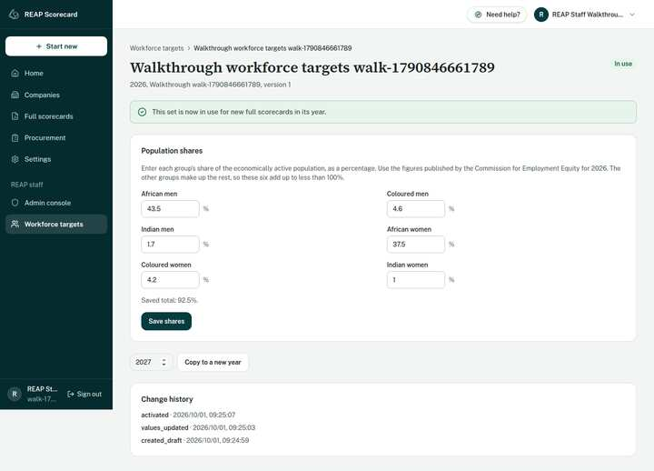

- **Workforce targets.** Create a set for the year:
  1. Enter the six population shares as percentages.
  2. Click **Save shares**.
  3. Click **Put this set in use**.

  Scorecards attach the set in use.
- **Admin console.** Read-only views of every company, procurement scorecard
  and full scorecard, for support.

  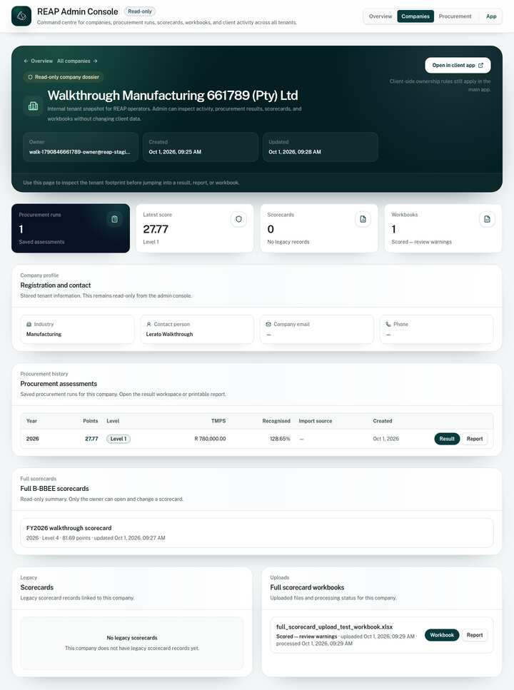

Other users cannot open either page.
